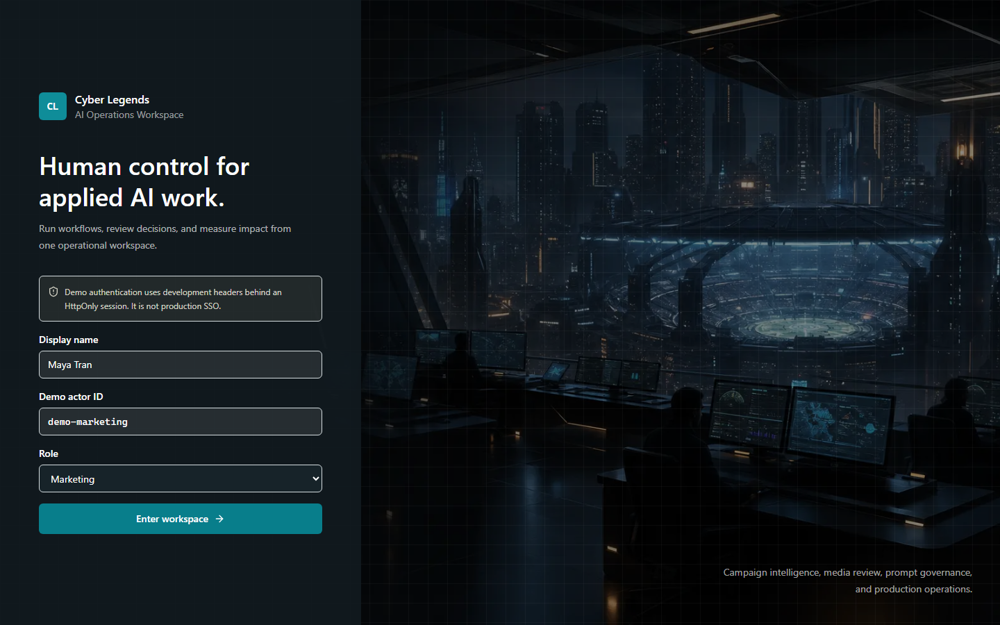
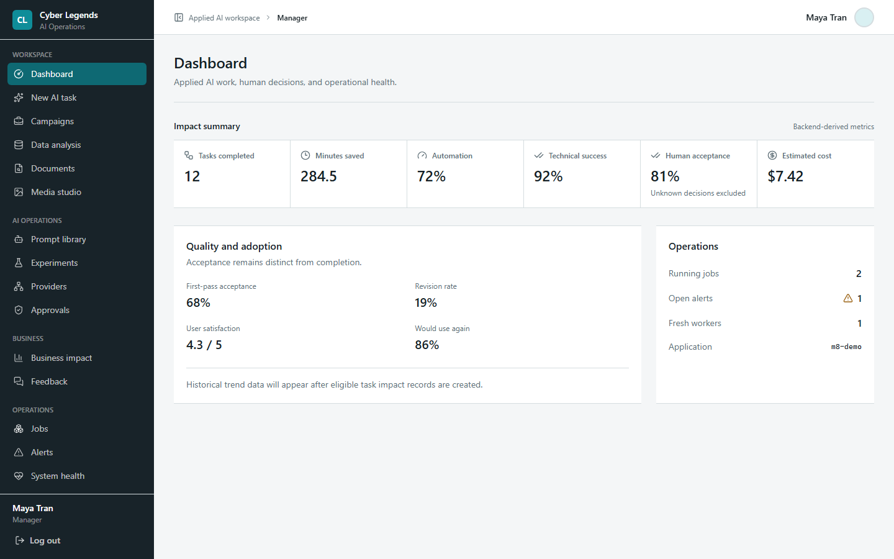

# Cyber Legends AI Operations Workspace

Production-oriented Applied AI product with a Next.js operations workspace and a
FastAPI backend. The application remains authoritative for workflow state, retries,
policy and approval decisions, persistence, authorization, and audit history.





Milestone 7 extends this foundation into an Applied AI workflow platform with managed
prompt versions and experiments, business-impact analytics, OpenAI/Gemini/Anthropic
adapters, signed n8n webhooks, review-gated media, deterministic CSV analysis, and safe
PDF/DOCX/TXT processing. Milestone 8 adds the responsive frontend, signed demo
sessions, a server-side BFF, generated OpenAPI types, accessible async status views,
frontend tests, and production container packaging. Automatic publishing remains
intentionally unavailable without policy-controlled approval.

```bash
alembic upgrade head
python -m app.cli.seed_m7_demo
```

Use `LLM_PROVIDER=mock` and `IMAGE_PROVIDER=mock` for deterministic local runs. The
stable workflow catalog is available at `GET /applied-workflows`; M7 architecture and
integration guides begin in `docs/architecture-m7.md`.

M7 hardening executes prompt experiments and provider comparisons as typed background
jobs. Their metrics are generated from real case executions and cannot be supplied by
clients. Data analysis, document processing, image generation, and storyboards resolve
an active managed prompt and persist its immutable version/hash. Every started applied
task reaches `COMPLETED`, `FAILED`, or `CANCELLED`; media assets additionally use the
review states documented in `docs/media-workflow-guide.md`.

## Architecture

```text
FastAPI Router
-> Application Service
-> Deterministic Workflow
-> Agentic Orchestrator
-> Specialist Agent
-> Bounded Agent Loop
-> Read-only Tools or Typed Action Proposal
-> Deterministic Policy Engine
-> Controlled Action Executor
-> Application Service
-> Repository
-> PostgreSQL
```

The three M4 specialists are `BRIEF_ANALYST`, `CONTENT_GENERATOR`, and
`CONTENT_REVIEWER`. Agents acquire bounded context, may request only their allowlisted
read-only tools, and return validated `BriefAnalysis`, `GeneratedContent`, or
`QualityReview` objects. Agents do not control workflow states, approve campaigns, or
publish content; the deterministic workflow interprets reviewer recommendations and
persists all campaign artifacts.

Approval requests follow:

```text
Approval Request
-> Authentication
-> Authorization
-> Approval Service
-> Transaction
-> Campaign and Workflow Update
-> Immutable Approval Record
```

Multi-row transactions use one lock order:

```text
Campaign
-> Workflow
-> Approval or related child rows
```

## Local Setup

Create a local `.env` from `.env.example`, then start PostgreSQL:

```bash
docker compose up -d postgres
docker compose ps
docker compose logs postgres
```

Install dependencies and run migrations:

```bash
python -m pip install -r requirements-dev.txt
alembic upgrade head
```

Run the API:

```bash
uvicorn app.main:app --host 0.0.0.0 --port 8000
```

Run the PostgreSQL worker in a second terminal:

```bash
python -m app.workers.main
```

Run the frontend in a third terminal:

```bash
cd frontend
pnpm install --frozen-lockfile
pnpm dev
```

Open `http://localhost:3000`, choose a demo identity and role, then use the task
catalog. Marketing users run campaign, CSV, document, image, and storyboard flows;
reviewers handle approvals; managers and administrators also access prompts,
experiments, providers, analytics, jobs, alerts, and health. See
`docs/frontend/DEMO_SCRIPT.md` for the 5-8 minute demonstration and
`docs/frontend/ARCHITECTURE.md` for the browser security boundary.

Useful endpoints:

- `GET /`
- `GET /health`
- `GET /ready`
- `GET /live`
- `GET /metrics` (monitoring bearer token required)
- `GET /docs`
- `POST /campaigns`
- `POST /workflows/campaigns/{campaign_id}`
- `POST /workflows/{workflow_id}/run`
- `POST /approvals`
- `GET /agent-runs`
- `GET /agent-runs/{agent_run_id}`
- `GET /agent-runs/{agent_run_id}/tool-calls`
- `GET /workflows/{workflow_id}/agent-runs`
- `GET /campaigns/{campaign_id}/agent-runs`
- `GET /action-requests`
- `GET /action-requests/{action_request_id}`
- `GET /action-requests/{action_request_id}/executions`
- `POST /action-requests/{action_request_id}/approve`
- `POST /action-requests/{action_request_id}/reject`
- `POST /action-requests/{action_request_id}/execute`
- `GET /campaigns/{campaign_id}/memories`
- `GET /workflows/{workflow_id}/memories`
- `GET /jobs`
- `GET /alerts`
- `GET /operations/summary`
- `GET /operations/workflows/{workflow_id}/timeline`
- `GET /operations/campaigns/{campaign_id}/timeline`
- `GET /evaluations`

## Workflow Behavior

`POST /workflows/{workflow_id}/run` enqueues a PostgreSQL job and returns `202` with
its `job_id`, status URL, and correlation ID. The worker executes the existing
deterministic workflow with short database checkpoints. Database rows are not locked
while an LLM call is running. Each Agent LLM turn reserves the workflow-level LLM
count, so Agent budgets cannot bypass the M3 workflow limit.

## M6 Production Operations

M6 implements asynchronous PostgreSQL jobs, worker heartbeats, fenced leases,
explicit retry classification, dead letters, cancellation checkpoints, a
transactional outbox, operational alerts, evaluation, operator APIs, observability,
and deployment hardening. Workflow/action state and corresponding outbox events
commit in one transaction. Each outbox event has an independent lease, heartbeat,
and fencing version; consumer side effects commit atomically with the fenced terminal
update so stale owners cannot commit.

HTTP requests, jobs, and outbox events propagate UUID correlation IDs. Logs are JSON
and redact credentials, prompts, and authorization data. `/metrics` exposes
low-cardinality Prometheus metrics only to the configured `METRICS_TOKEN` bearer;
OpenTelemetry spans remain safe no-ops unless an SDK/exporter is configured by the
deployment. `/ready` checks PostgreSQL, Alembic
head, queue access, worker freshness when work is pending, outbox backlog, and LLM
configuration without calling an LLM.

Operator routes require `MANAGER` or `ADMIN`. Sensitive writes use a pluggable
in-process rate limiter; a multi-replica deployment must replace it with a shared
implementation. Evaluation datasets are immutable by name/version. Runs persist
deterministic correctness, reliability, behavior, quality, token/cost metrics, and
explicit regression results with prompt/model/tool/policy/application versions.
`SYSTEM` evaluation executes the real campaign workflow and Agentic runtime with a
deterministic mock provider; `SNAPSHOT` remains available for scoring imported output.

Production containers:

```bash
docker compose -f docker-compose.production.yml up --build
```

Production requires explicit PostgreSQL/JWT values plus `SESSION_SECRET`,
`OIDC_ISSUER`, `OIDC_CLIENT_ID`, `OIDC_CLIENT_SECRET`, `OIDC_REDIRECT_URI`, and
`OIDC_POST_LOGOUT_REDIRECT_URI`. The frontend uses the internal
`BACKEND_API_URL=http://api:8000`; the API is not published directly by the production
Compose file. Validate configuration before deployment with
`docker compose -f docker-compose.production.yml config`.

The local demo stack is intentionally separate and is not a production authentication
configuration:

```bash
docker compose -f docker-compose.demo.yml up -d --build
```

M8 provides the Next.js operations workspace, a server-side OIDC adapter, encrypted
HttpOnly sessions, a streaming BFF, owner-filtered collection APIs, and backend
resource authorization. See `docs/frontend/SECURITY_MODEL.md`,
`docs/frontend/DEPLOYMENT_GUIDE.md`, and `docs/frontend/E2E_GUIDE.md`.

## Agent Runtime

Each specialist run is bounded by `AGENT_MAX_ITERATIONS`, `AGENT_MAX_LLM_CALLS`,
`AGENT_MAX_TOOL_CALLS`, and `AGENT_TIMEOUT_SECONDS`. Execution stops on validated
final output, a provider or validation failure, timeout, or any exhausted limit.
There is no recursive or unbounded loop.

M4 tools expose only fresh, read-only views of prior workflow summaries, revisions,
and quality feedback. A tool reads through `AgentReadQueryService`, then a repository,
inside a short lock-free PostgreSQL read transaction. Inputs are schema validated and
scoped to the run's campaign/workflow; outputs are sanitized, treated as untrusted,
and truncated to `AGENT_MAX_TOOL_RESULT_CHARACTERS`. There are no shell, filesystem,
network, or write-capable Agent tools.

Each specialist receives a frozen, typed context containing only what it needs. The
analyst receives campaign brief data, the generator receives validated analysis and
relevant revision feedback, and the reviewer receives the analysis plus generated
content. Contexts contain no ORM objects, database sessions, credentials, or provider
payloads.

Every specialist execution creates an `agent_runs` audit row with prompt version and
counters. Its lifecycle is `CREATED -> RUNNING -> COMPLETED`, with `FAILED` and
`LIMIT_EXCEEDED` as terminal alternatives. Every attempted tool execution creates an
`agent_tool_calls` row with sanitized arguments, bounded result summary, status,
duration, and safe error fields. Tool calls move from `REQUESTED` to `RUNNING` and
then to `COMPLETED` or `FAILED`; rejected requests terminate as `REJECTED`. Internal
tool timeouts, outer Agent timeouts, and explicit task cancellation are finalized as
safe terminal audit records, so no interrupted call remains `RUNNING`. Prompts,
hidden reasoning, provider payloads, and raw database errors are not persisted.

`MockLLMClient` supports `scripted_turns` containing `AgentTurn` values for fully
deterministic tool-call/final-output tests. Default tests never contact a real LLM.

Content generation is retried only for bounded review failures:

```text
GENERATING -> REVIEWING -> GENERATING
```

Retries stop when `MAX_CONTENT_RETRIES` is exhausted. A passing review reaches
`PENDING_APPROVAL`. A review with `MANUAL_REVIEW_REQUIRED`, or exhausted retries,
stays in `MANUAL_REVIEW_REQUIRED`; it is not silently promoted to final approval.

If workflow execution fails before a terminal/manual/approval state, the failure is
persisted as `FAILED` with a stable error code and a sanitized error message.

Approval decisions are append-only. The database enforces one approval record per
workflow. A revision request closes the old workflow at `REVISION_REQUIRED`,
increments the campaign version, and leaves the campaign in `REVISION_REQUIRED`.
Create a new workflow for that campaign to continue revision generation; the new
workflow starts at `REVISION_REQUIRED`, stores `parent_workflow_id`, increments
`revision_number`, and can run back to `PENDING_APPROVAL`.

The database also enforces one active workflow per campaign with a PostgreSQL
partial unique index over active statuses where `completed_at IS NULL`.

Workflow creation is allowed only for campaigns in `RECEIVED` or
`REVISION_REQUIRED`. Approved, rejected, failed, pending approval, and manual
review campaigns cannot be reopened implicitly.

Approval and Agent-run audit APIs require authentication. Agent-run audit reads are
authorized only for `REVIEWER`, `MANAGER`, `ADMIN`, and `SYSTEM`; other authenticated
roles receive `403`. In development and tests, requests may pass `x-actor-id` and
`x-actor-role`; production should use Bearer JWTs with `sub` and `role` claims.

The audit API returns identifiers, lifecycle status, counters, timestamps, sanitized
bounded tool arguments/results, and stable safe error fields. It never returns raw
prompts, hidden reasoning, credentials, provider payloads, or raw database details.

## Policy and Controlled Actions

M5 keeps authority outside the Agent runtime:

```text
Agent Proposal
-> Deterministic Policy Engine
-> Action Request
-> Human Approval when required
-> Controlled Action Executor
-> Execution Audit
-> Structured Memory
```

The policy engine is deterministic and side-effect free. It validates the action
name, Agent allowlist, typed arguments, campaign/workflow state, revision scope, and
risk definition in a fixed order. Unknown, generic, aliased, nested, or unregistered
operations are denied by default. It never uses an LLM, database write, or network
call to classify an action.

`SAFE` actions are bounded, reversible internal operations and execute automatically.
`APPROVAL_REQUIRED` actions remain pending until an authorized human approves them.
`FORBIDDEN` proposals are rejected and audited without a handler. The initial action
set is intentionally small: internal recommendations, summaries, revision drafts,
selected metadata updates, regeneration requests, review notes, and manual-review
transitions. State-changing handlers use existing application and workflow services.

Action requests use `version` for optimistic locking. Approval, rejection, expiration,
and execution races have one committed winner; stale operations receive stable
conflicts. A deterministic idempotency key is derived from campaign, workflow,
revision, action name, and normalized arguments. PostgreSQL uniqueness and executor
reservation ensure one request and one side effect. Sensitive approvals expire after
the configured TTL. Request and execution rows preserve policy, human decision,
terminal status, duration, and sanitized result/error summaries.

The proposal-time policy result is historical audit evidence, not permanent
authorization. Immediately before every side effect, the executor reloads and locks
the current campaign, workflow, and action request in this order:

```text
Campaign -> Workflow -> ActionRequest -> ActionExecution
```

The executor re-evaluates policy and reserves the execution in the same short
transaction, then releases all locks before calling the handler. The reservation
stores expected campaign status/version and workflow status/revision. Handlers lock
the campaign and workflow in the same order and reject the mutation with a stable
`ACTION_STATE_CHANGED` conflict if the expected state no longer matches. This closes
the policy check/use gap without holding database locks during handler execution.

Human approval does not bypass fresh policy evaluation. An approved action may still
be denied if campaign or workflow state changed. If a `SAFE` action now requires
approval, automatic execution stops; if the required role becomes stronger, the old
approval is insufficient. The original policy fields remain unchanged while explicit
`last_policy_*` fields expose the latest pre-execution decision safely.

Request, execution, and memory persistence inspect PostgreSQL constraint names and
map only known uniqueness constraints to idempotent/domain conflicts. Foreign-key,
check, null, unknown, or missing constraint diagnostics become a safe
`PERSISTENCE_ERROR`; raw SQL and PostgreSQL messages are not returned by the API.

Agents do not approve their own actions. Agents do not approve campaigns. Agents do
not publish campaigns. `SYSTEM` does not impersonate human action approval. M5 actions
are internal only, and no action can execute arbitrary SQL, shell commands, URLs, or
policy changes.

## Memory

Working memory is bounded in `AgentState` and stores only truncated operational
messages, tool results, policy decisions, and action result summaries for the current
run. Episodic and operational memory is stored in PostgreSQL as typed events scoped to
campaign, workflow, Agent run, and optional action request.

`MemoryService` validates scope, removes secret-like keys and values, bounds metadata
and summaries, applies expiration, and returns deterministic recent-first results.
Read-only memory tools retrieve recent campaign events, failures, review feedback, and
action results through the service layer. The authenticated memory APIs support
bounded pagination and event filters. There is no user-facing memory write endpoint,
hidden reasoning persistence, vector database, embedding, or semantic retrieval.

Terminal action state and memory recording are separate, observable audit steps. A
successful handler first commits the action request/execution as completed with
memory status `PENDING`, then records one memory event identified by
`action_execution_id + event_type`. PostgreSQL prevents duplicate source events.
Memory success changes the status to `RECORDED`; a memory failure changes it to
`FAILED` while preserving the completed action and a sanitized retryable error.

Action success is not reversed solely because memory recording failed. Memory
reconciliation never re-executes the action handler. Operators or tests can call
`ActionService.reconcile_pending_action_memories(limit=100)` manually; repeated calls
are idempotent and repair only `PENDING` or `FAILED` memory audit records.

## Database

The app uses async SQLAlchemy with `postgresql+asyncpg`.
Production schema changes are handled through Alembic, not `create_all()`.

Migration commands:

```bash
alembic upgrade head
alembic current
alembic history
alembic downgrade -1
alembic check
```

Reset local database volume:

```bash
docker compose down -v
```

## Quality Checks

```bash
python -m ruff check app tests
python -m ruff format --check app tests
python -m mypy app
python -m bandit -r app
python -m pytest -v
python -m pytest --cov=app --cov-report=term-missing
```

PostgreSQL integration and E2E tests are guarded to avoid mutating a developer
database accidentally. Run them only against a migrated test database:

```bash
set RUN_POSTGRES_TESTS=1
python -m pytest tests/integration -v
```

Run the complete deterministic M3/M4/M5 suite and coverage report with:

```bash
set RUN_POSTGRES_TESTS=1
set LLM_PROVIDER=mock
python -m pytest -v
python -m pytest --cov=app --cov-report=term-missing
```

CI sets `RUN_POSTGRES_TESTS=1`, starts PostgreSQL, applies Alembic migrations,
runs an Alembic drift check, and executes the full quality suite. The PostgreSQL
suite covers repository persistence, database constraints, workflow/service
lifecycle behavior, campaign and action approval conflicts, controlled-action
concurrency, stale policy/approval races, expected-state handlers, constraint-specific
error mapping, memory failure/reconciliation, API flows, and E2E approval, revision,
retry, failure, and Agent proposal scenarios.

## Security

Production rejects unsafe `change-me` secrets. The mock LLM provider requires no API
key and is the default for tests. Real OpenAI usage requires `LLM_PROVIDER=openai`,
`LLM_API_KEY`, and `LLM_MODEL`.

## Deferred Scope

M8 is implemented through release candidate `1.0.0-rc.1`. The intentionally deferred
scope is provider-specific enterprise SSO rollout beyond the generic OIDC adapter,
external publishing, a generic workflow builder, vector/semantic memory UI,
autonomous supervisor UI, billing, native mobile applications, and multi-region
deployment.
Agents still cannot approve campaigns, publish externally, execute arbitrary SQL or
shell commands, or bypass deterministic policy and human approval.

## M7 Final Hardening

Media attempt success is fenced by the live job lease and commits attempt, asset,
task, and ready-for-review outbox state atomically. Failure, cancellation, and
terminal-job reconciliation leave no active `STARTED` attempt. Attempt numbers are
allocated under an asset row lock, and stale workers cannot publish success.

M7 services map only named PostgreSQL uniqueness constraints to conflicts or
idempotent results. Unknown, foreign-key, check, and null violations remain safe
persistence failures after rollback. Technical completion is separate from nullable
human acceptance; acceptance analytics exclude unknown decisions from the
denominator.

The M8 frontend shell, authentication, task workspace, prompt and experiment UI,
media studio, upload UI, impact dashboard, and feedback forms are implemented.
